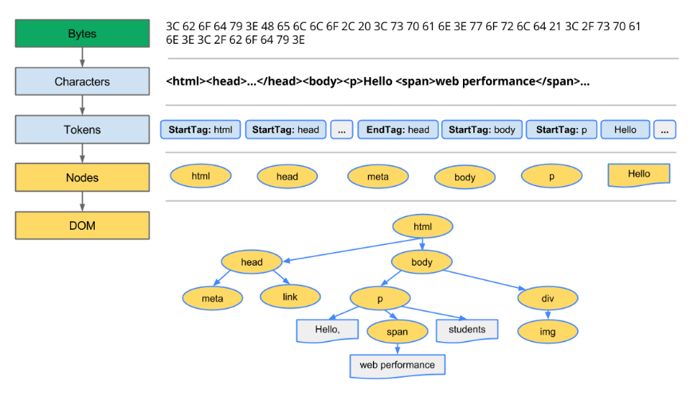
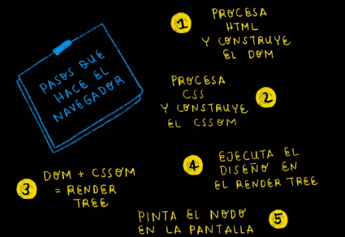

# Para qué sirve HTML y CSS3 ?

## HTML (HypertText Markup Language)

Es un lenguaje de marcado usado para decirle a tu navegador cómo estructurar la páginas que visitas. No se le considera un lenguaje de programación.

## CSS (Cascading Style Sheets)

Es un lenguaje que nos permite crear páginas web con un diseño agradable para los usuarios. Tampoco es un lenguaje de programación.

# Renderizado de la Web

**Tenemos que tener en cuenta estos conceptos:**

## DOM (Document Object Model)

Al escribir el código HTML lo pasaremos al navegador pero el navegador no entiende esas líneas de cófigo HTML, así que va a transformar todas esas etiquetas a objectos que son entendibles para el navegador.

## CSSOM

También es una representación de objectos pero no de HTML sino de CSS. El navegador agarra el código CSS y lo convierte en objetos para que sea entendible por el navegador.

Para que se cree el DOM y el CSSOM se debe tener en cuenta este proceso:

* **Bytes** convierte el código en bytes.
* **Characters** convierte los bytes en carácteres según la codificación especificada (UTF-8).
* **Tokens** transforma los carácteres en tokens en base al estándar W3C HTML5, identificando cuales es el orden de las etiquetas o tags.
* **Nodes** luego transforma los tokens a nodes, que son precisamente objetos. Y esto son los objetos que entiende el navegador.
* **DOM** por último se relaciona todos los elementos y crear un árbol en base a la estructura que tenga en el html.



## Render Tree

Es un árbol que une el DOM y el CSSOM para poder renderizar toda la página web. 

***Pasos que sigue el navegador para construir las páginas web:***

* Procesa el HTML para construir el DOM
* Procesa el CSS. para construir el CSSOM
* El DOM se une con el CSSOM para crear el Render Tree
* Se ejecutan los estilos CSS en el Render Tree
* Se pintan los nodos en pantalla para que el usuario vea el contenido de la página web



**Nota** Tener en cuenta que esto nos sirve para darnos cuenta del performance o rendimiento que va tener nuestra aplicación.

# Tipos de Errores

### Errores Lógicos

Son errores de escritura en el código que hacen que el programa no funcione.

### Errores Sintácticos

En estos errores la sintaxis es correcta, pero el código no hace lo que debería, por lo que el programa funciona de forma incorrecta.

## Debugging

Podemos usar un sistema de validación de etiquetas. [W3C](https://validator.w3.org)

# Tipos de Selectores

```css
*{
  /*selector universal*/
}
h2{
  /*selector de tipo de elemento*/
}
.title{
  /*selector con clase*/
}
#article{
  /*selector con id*/
}
```

### Pseudo-clases

Estado especial del elemento

```css
p:first-child{
  color: blue;
}
p:last-child{
  color: green;
}
p:nth-child(2n){ /*todos los números pares*/
  color: red;
}
p:nth-child(2n+1){ /*todos los números impares*/
  color: blue;
}
```

### Pseudo-elementos

Estilo a una parte específica del elemento

```css
p::before{
  content: "";
}
p::after{
  content: "":
}
p::first-letter{
  color: red;
  font-size: 20px;
  text-transform: uppercase;
}
```

# Modelo de Caja

Formado por el contenido, el padding, el. border y por último el margin.

```css
.box{
  /* te permite que el ancho y alto definido no se altere por el padding o por el border */
	box-sizing: border-box;
}
```

# Unidades de medida absolutas y relativas

## Unidades de medida absolutas

Como los pixeles (px), cm, mm, pt, pc.

## Unidades de medida relativas

Porcentajes (%), em, rem, vh, vw

# Arquitecturas CSS

Objetivos de una arquitectura debe ser:

* predecible
* reutilizable
* mantenible
* escalable

Buenas prácticas:

* Establecer reglas en el equipo
* Explicar la estructura base
* Establecer estándares de codificación
* Evitar largas hojas de estilo
* Documentación

## OOCSS 

CSS orientado a objetos

```html
<style>
    .header {
      background-color: coral;
      height: 90px;
    }
    .footer {
      background-color: brown;
      height: 200px;
    }
    .container {
      width: 50%;
    }
</style>
<body>
	<header class="container header">
   	Header
  </header>
  <footer class="container footer">
  	Footer
  </footer>
</body>
```


## BEM

Block Element Modify. Se encarga de separar los elementos, bloques y modificadores.

```html
<style>
    .header{
      width: 50%;
      height: 100px;
    }
    .header-button-red{
      background: red;
    }
    .header-button-yellow{
      background: yellow;
    }
  </style>
  <body>
    <header class="header">
      <button class="header-button-red">
        Red
      </button>
      <button class="header-button-yellow">
        Yellow
      </button>
    </header>
  </body>
```


## SMACSS

Arquitectura de CSS Escalable y Modular.

Para esto debemos hacer lo siguiente

* Dividir nuestro CSS en componentes base, son los elementos que vamos a estar usando en toda la aplicación
* Layout, Elementos que se utilizan en la página una sola vez
* Module, son componentes que estaremos usando más de una vez
* State, son los elementos que cambian los estilos al realizar ciertas acciones
* Theme, cuando estos cambies los colores tambien se vean reflejados los cambios

# ITCSS

Triángulo Invertido de CSS

Dividir el archivo CSS en distintas partes para que no se combinen entre sí. Nos sirve para evitar especificidad, se refiere que hay elementos que tienen mayor peso que otros.

## Atomic Design

Átomos (elementos pequeños), Moléculas, Organismos, Template, Páginas completas.

## Qué es un componente?

Es un elemento que se puede reutilizar para construir otros componentes.

Por eso antes de empezar a desarrollar, tenemos que visualizar nuestros componentes para que sea más fácil reutilizarlos en diferentes partes de nuestra aplicación.

# Procesadores CSS

A menudo en un proyecto grande los archivos CSS se vuelven muy extensos para eso estan los prepocesadores que nos permite desarrollar aplicaciones web más productivas.

Ya que podemos evitar tener tantas líneas de código, por lo que en los procesadores pueden tener variables, funciones, mixins, reutilización de códigos, flexibilidad de desarrollo.

## Cómo funcionan los prepocesadores

Se escribe con una sintaxis especial que nosotros indicamos y luego debe ser compilado a CSS para ser comprendido en el navegador. Es como *un CSS con esteroides*

## Cómo se escribe en Sass 

```scss
/* Variables */
$white: #fff;

/* Anidamiento */
.login-register{
  font-size: 14px;
  a{
    color: $white;
    font-size: 16px;
    text-decoration: none;
    font-weight: 600;
  }
}

/* Herencia */
.flex{
  display: flex;
  align-items: center;
}
.header {
  width: 100%;
  height: 80px;
  @extend .flex;
  justify-content: space-between;
  margin-bottom: 20px;
}

/* Mixin */
@mixin flex{
  display: flex;
  align-items: center;
}
.header {
  width: 100%;
  height: 80px;
  @include flex;
  justify-content: space-between;
  margin-bottom: 20px;
}
```